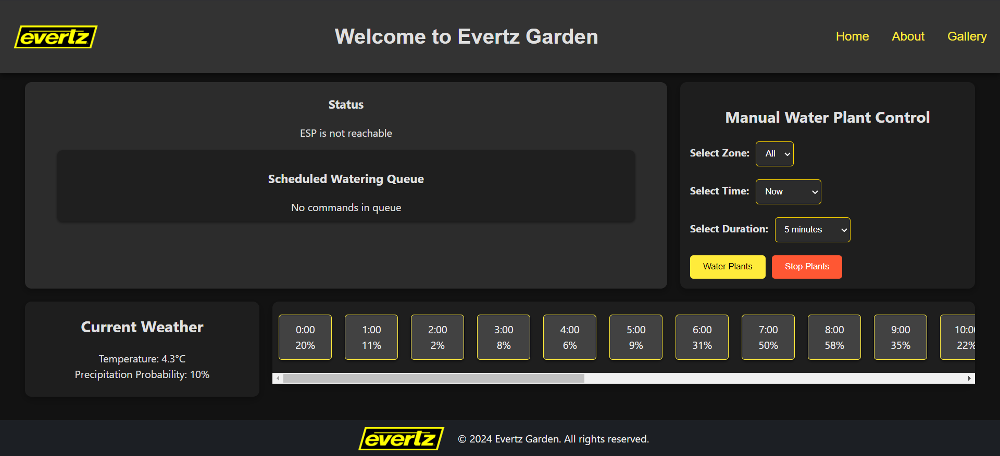

## Frontend

This project hosts the frontend for the Smart Garden application. It provides a user interface to monitor and control the garden, view weather forecasts, and manage watering schedules.

### Screenshot

*Caption: The main interface of the Evertz Garden webpage. It displays the current status of the ESP, a scheduled watering queue, manual controls for watering plants by zone, duration, and time, current weather conditions (temperature and precipitation probability), and an hourly precipitation forecast.*

### Features

The main page, accessible via the "Home" navigation link, displays several key sections:
*   **Status:** Shows the current connectivity status of the ESP (e.g., "ESP is not reachable").
*   **Scheduled Watering Queue:** Lists any watering commands that are pending execution.
*   **Manual Water Plant Control:** Allows users to:
    *   Select a specific zone or all zones.
    *   Choose a time for watering (e.g., "Now").
    *   Set the duration for watering (e.g., "5 minutes").
    *   Start or stop the watering process using "Water Plants" and "Stop Plants" buttons.
*   **Current Weather:** Displays the current temperature and precipitation probability.
*   **Hourly Forecast:** Shows a scrollable view of the precipitation probability for the upcoming hours.

The application also includes "About" and "Gallery" pages, accessible via the navigation bar. A footer displays copyright information.

### `npm install`

Installs all of the necessary packages. This is required before running the application for the first time, as the `node_modules` folder (which contains the dependencies) is not committed to the repository.

### `npm start`

Launches the frontend application in development mode.
Open [http://localhost:3000](http://localhost:3000) to view it in your browser. The page will reload if you make edits.
You will also see any lint errors in the console.

### Backend Integration

The frontend requires the backend service to be running to function correctly. If the backend is not accessible, the frontend may display an error message or limited information (e.g., "ESP is not reachable" if the backend cannot communicate with the ESP).

Refer to the backend documentation at [../backend/README.md](../backend/README.md) for instructions on how to set up and run the backend service.
